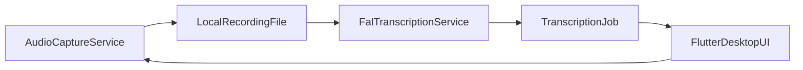

Building a desktop app for meeting transcription involves three distinct technical challenges: capturing "loopback" (system) audio, processing it through an AI model, and protecting your credentials.

## 1. UI Foundation

For Windows, macOS, and Linux, the standard **Flutter Desktop** framework is your best bet. It provides native performance and a single codebase for all three.

* **Recommendation:** Stick to the core Flutter SDK. Use `window_manager` to control window sizing/positioning, which is essential for desktop "utility" apps.

---

## 2. Audio Recording (System + Microphone)

This is the most complex part. Capturing what *you* say (microphone) is easy; capturing what *others* say in the meeting (system output) requires "Loopback" recording.

| Package | Purpose | Platforms |
| --- | --- | --- |
| **`desktop_audio_capture`** | **Top Pick.** Specifically built to capture both microphone and system audio (speakers). | Win, Mac, Linux |
| **`record`** | Industry standard for microphone input and streaming audio bytes. | All |
| **`audio_toolkit`** | Excellent for macOS; uses Apple's latest `ScreenCaptureKit` for high-quality system audio. | macOS 13+ |

### The "Mixing" Strategy

To transcribe a meeting, you usually need to merge the microphone and system audio into one stream.

1. Use `desktop_audio_capture` to get two separate streams.
2. **Transcribe separately:** This is actually better for AI accuracy (Speaker Diarization), as it prevents your voice from overlapping with the meeting audio in the same file.
3. **Mix:** If you must have one file, use a package like `ffmpeg_kit_flutter` to merge the two recordings after the meeting ends.

---

## 3. Transcription (STT)

You have three main paths: **Cloud** (fast), **Cloud via FAL** (Whisper as-a-service), or **On-Device** (private, hardware-intensive).

* **Cloud (Recommended for Meetings):** Use **Deepgram** (`deepgram_flutter`) or **OpenAI Whisper API**. They handle long-form audio and multiple speakers far better than local models.
* **Cloud via FAL (Whisper-as-a-service):** Use **FAL wizper** via the `fal_client` Dart package, calling the `fal-ai/wizper` endpoint.
* **On-Device (Private):** Use **`whisper_flutter_plus`**. It runs the Whisper model locally using C++.

> **Warning:** Running Whisper locally on a Linux or Windows laptop without a dedicated GPU can be very slow.

### 3.1 Transcription via FAL wizper

FAL provides managed Whisper-large models that are well-suited for long-form meeting recordings.

- **Flow:**
  1. Record the meeting to a local audio file (e.g. `.wav` or `.mp3`) after capturing mic + system audio.
  2. Use `fal_client` to upload this file via `fal.storage.upload(XFile)` and obtain a public `audio_url`.
  3. Call one of:
     - `fal.subscribe("fal-ai/wizper", input: {...})` for a simple, blocking request.
     - `fal.queue.submit("fal-ai/wizper", input: {...})` for long meetings, then poll with `queue.status` and fetch the final result with `queue.result`.

- **Recommended default input payload:**
  - `task`: `"transcribe"` (later you can expose `"translate"` as an option).
  - `language`: `null` to auto-detect, with the note that this slightly increases inference time.
  - `chunk_level`: `"segment"`
  - `max_segment_len`: `29`
  - `merge_chunks`: `true`
  - `version`: `"3"` (Whisper large v3)

- **Data model (matching wizper output):**
  - `TranscriptionResult`:
    - `text` – full transcription text.
    - `chunks` – list of `WhisperChunk`.
    - `languages` – list of inferred languages (can be `null`).
  - `WhisperChunk`:
    - `timestamp` – \[start, end\] in seconds.
    - `text` – text for that segment.

You should persist the raw chunks as returned, and optionally post-process them into paragraphs, sections, or summaries later.

### 3.2 High-level architecture with FAL

For long meetings, treat transcription as an asynchronous job:



- A `TranscriptionJob` stores:
  - `requestId` from `fal.queue.submit`.
  - current `status` (queued, running, completed, failed).
  - timestamps and a reference to the final `TranscriptionResult` when done.

---

## 4. Secure Storage for API Keys

Never hardcode keys. You need two layers of security:

### A. Development (Build-time)

Use **`envied`**. It allows you to store keys in a `.env` file and generates an **obfuscated** Dart class. This makes it significantly harder for hackers to "string-dump" your binary and find your keys.

```dart
// Example using Envied
@Envied(path: '.env')
abstract class Env {
  @EnviedField(varName: 'OPENAI_KEY', obfuscate: true)
  static final String apiKey = _Env.apiKey;
}

```

### B. Production (User-provided keys)

If your users provide their own API keys, use **`flutter_secure_storage`**.

* **Windows:** Uses the Data Protection API (DPAPI).
* **macOS:** Uses the Keychain.
* **Linux:** Uses `libsecret` (Keyring).

### C. FAL API Key (`FAL_KEY`)

For FAL wizper, follow these rules:

- **Preferred (secure) approach – server-side:** keep `FAL_KEY` on a small backend (Dart/Node/Python, etc.) and only talk to that backend from your Flutter desktop app. The backend uses `fal_client` and environment variables for `FAL_KEY`.
- **Desktop-only experiments:** if you call FAL directly from the Flutter desktop app:
  - Set `FAL_KEY` as an environment variable for your app process and access it via `envied` with obfuscation.
  - Optionally allow users to override the key and store that value with `flutter_secure_storage`.
  - Treat this as suitable for personal or internal tools rather than wide distribution, since desktop binaries can still be reverse-engineered.

---

## Summary Recommendation

1. **UI:** Flutter Desktop + `window_manager`.
2. **Audio:** `desktop_audio_capture` (mic + system audio) and optionally `ffmpeg_kit_flutter` to mix streams when needed.
3. **Transcription:** FAL wizper via `fal_client` (`fal-ai/wizper`) for managed Whisper-large, with `queue`-based handling for long meetings. You can still fall back to OpenAI Whisper or other providers if desired.
4. **Security:** `envied` for build-time key obfuscation, environment variables (especially on any backend) for `FAL_KEY`, and `flutter_secure_storage` for user-provided or override keys.

