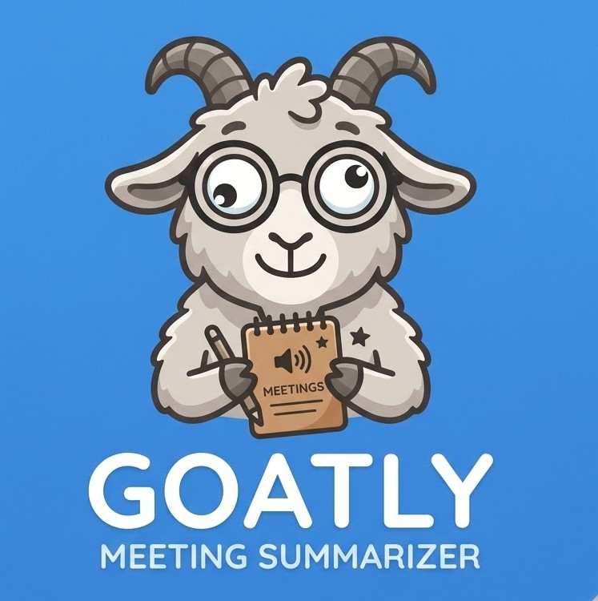
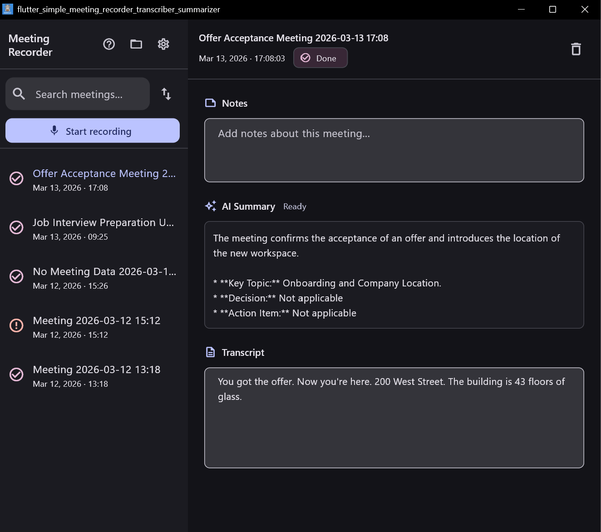

## GOATLY Meeting Summarizer: Free AI Transcription & Summary





**GOATLY** is a cross-platform desktop and mobile application designed for **free and easy meeting transcription** and **AI-powered summarization**. Use it to record meetings on Windows, macOS, Linux, iOS, or Android, and get instant, searchable transcripts and summaries.

**[Full documentation →](https://justinguese.github.io/flutter-simple-meeting-recorder-transcriber-summarizer/)**

### Our Vision

We believe that high-quality **meeting transcription** and **summarization** should be accessible to everyone. Our vision is to provide a powerful, privacy-first tool that offers the best of both worlds:

- **Complete Freedom:** A fully **open-source** experience where you bring your own API keys (FAL, OpenRouter) and maintain total control over your data.
- **Effortless Productivity:** An **optional managed mode** for those who want a seamless, "just works" experience without managing API keys or infrastructure.

### Features

- **One-click recording** — Start and stop your microphone with a single button.
- **AI transcription** — Lightning-fast speech-to-text powered by [FAL Wizper](https://fal.ai/models/fal-ai/wizper).
- **AI summarization** — Get key points and action items automatically via OpenRouter LLMs.
- **Search & sort** — Powerful full-text search across all your past recordings.
- **Secure key storage** — Your API keys are encrypted and stored locally via `flutter_secure_storage`.
- **Cross-platform** — Native performance on Windows, macOS, Linux, iOS, and Android.

### Deployment modes

**Fully open source** — Bring your own [FAL](https://fal.ai) and [OpenRouter](https://openrouter.ai) API keys. No sign-in required. Complete control, zero cost after free-tier quotas are exhausted (FAL: $5 monthly spend, OpenRouter: variable).

**Managed mode (free-tier)** — Sign in with Google/email. GOATLY provisions API keys automatically. Free tier covers ~500 minutes of transcription + summaries per month. For more usage, upgrade to a paid tier.

**Managed mode (paid)** — Upgrade from free tier within the app for higher transcription and summarization limits.

### Download

Pre-built binaries are attached to every [GitHub Release](../../releases).

| Platform | File |
|----------|------|
| Windows  | `goatly-windows.zip` — extract and run the `.exe` |
| macOS    | `goatly-macos.zip` — extract and drag `.app` to Applications |
| Linux    | `goatly-linux.tar.gz` — extract and run the binary |

### Setup (build from source)

1. **Install dependencies**

   ```bash
   flutter pub get
   ```

2. **Generate app icons**

   ```bash
   dart run flutter_launcher_icons
   ```

3. **Run the app**

   ```bash
   flutter run -d windows   # or macos / linux
   ```

   Sign in on first launch — in managed mode no API keys are needed.

4. **Optional: bring your own FAL key**

   ```bash
   export FAL_KEY="fal-…"   # bash/zsh
   $env:FAL_KEY = "fal-…"   # PowerShell
   ```

   Or use the in-app key dialog (key icon in the app bar).

### Notes

- **System Audio Capture:** Supports both microphone and system/loopback recording on Desktop platforms via the shared `df_audio_capture` library.
- **Shared Libraries:** This project utilizes the [df_flutter_shared](https://github.com/JustinGuese/df_flutter_shared) ecosystem for core functionalities including audio capture, REST-based Firebase Auth (Windows/Linux), and unique device identification.
- See the [docs site](https://justinguese.github.io/flutter-simple-meeting-recorder-transcriber-summarizer/) for the full usage guide, configuration reference, [shared library documentation](https://justinguese.github.io/flutter-simple-meeting-recorder-transcriber-summarizer/shared-libraries/), and contributing instructions.
